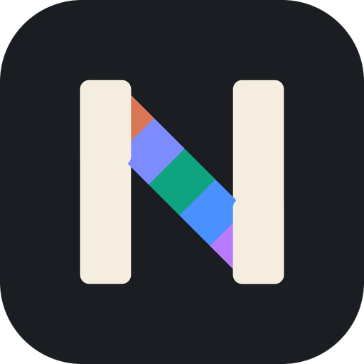
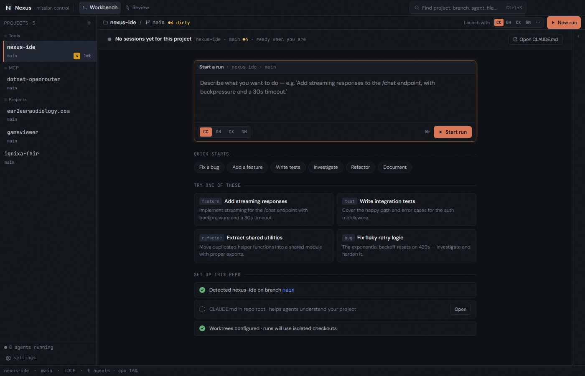

<div align="center">
  
  <h1>Nexus IDE</h1>
  <p>
    <b>Developer Mission Control — Project Orchestration for AI-Assisted Workflows</b>
  </p>

[](https://www.electronjs.org/)
[](https://react.dev/)
[](https://www.typescriptlang.org/)
[](https://tailwindcss.com/)
[](LICENSE)

</div>

---

> **Project Status:** Early Development / Personal Project. Nexus is an opinionated developer tool exploring "mission control" UX for AI-assisted software engineering. Built for power users managing many repos, branches, worktrees, and agent sessions simultaneously.

---

## Overview

**Nexus** is an Electron-based desktop application built around **project orchestration**, not file editing.
It solves the problem of managing many concurrent projects, branches, worktrees, and AI agent sessions by making the **project** the primary unit of navigation — with integrated terminals, rich git tooling, and a **Plan → Execute → Validate** pipeline for AI-assisted development.

Nexus is not a code editor. It is a **command center** that sits alongside your editor (VS Code, Rider, etc.) and gives you:

- Instant context-switching between projects with full git state visibility
- First-class worktree management with per-worktree agent launching
- Real terminal emulation with live AI agent telemetry (Claude Code, Copilot CLI, Aider)
- Rich diff viewing, staging, committing, and code review from a single pane
- A pipeline system for orchestrating AI agents across plan/execute/validate phases

**Target user**: A principal+ engineer managing 5–15+ active repositories, using AI coding agents daily, and working across multiple branches/worktrees simultaneously.

<div align="center">
  <br/>
  
  <br/>
  <em>Nexus IDE — project orchestration with integrated git, pipelines, and agent terminals</em>
  <br/><br/>
</div>

---

## Key Features

### Project & Repository Management

The **Project Rail** is a left sidebar that gives you at-a-glance visibility across all registered repos:

- **At-a-glance status** per project — current branch, change count, ahead/behind remote
- **One-click context switching** — select a project and the entire UI pivots to its state
- **Project groups** — create, rename, delete, and collapse/expand groups to organise repos by team, client, or domain
- **Drag-and-drop ordering** within groups
- **Directory scanning** — scan a root folder to discover and import all `.git` repos (3 levels deep, skips `node_modules`)
- **Live file watching** via `@parcel/watcher` (native `ReadDirectoryChangesW` on Windows) — git state refreshes automatically when files change, no manual polling

Projects and group layout are persisted across sessions via encrypted `electron-store`.

---

### Terminal Management

Nexus embeds real terminal sessions directly in the UI — not a fake shell, a full PTY.

**Core:**
- Real terminal emulation via [xterm.js](https://xtermjs.org/) with WebGL renderer (canvas fallback)
- PTY process management via [@lydell/node-pty](https://github.com/nicolo-ribaudo/node-pty) with ConPTY on Windows
- Shell auto-detection: `pwsh.exe` → `powershell.exe` → `cmd.exe` (Windows), `$SHELL` / `/bin/zsh` (macOS/Linux)
- Right-click to copy selected text

**PATH & environment:**
- On launch, Nexus reads the full system PATH from the Windows Registry (via PowerShell) or from a login shell on macOS/Linux, then merges it into all spawned PTY processes — fixes the "command not found" problem common when launching Electron apps from a GUI shortcut
- Dugite's bundled `git.exe` is appended as a guaranteed fallback on Windows
- `CLAUDE_CODE_GIT_BASH_PATH` is auto-detected on Windows (dugite `sh.exe` → PATH entries → well-known Git for Windows locations) so Claude Code works without manual configuration

**Session experience:**
- **Session types**: Claude Code, GitHub Copilot CLI, Aider, or any shell — each with its own color accent
- **Launch menu** — quick-launch buttons for Shell, Claude Code, and Copilot; custom commands via the `custom…` menu
- **Per-worktree sessions** — each terminal is bound to a specific worktree path, so agent sessions run in the right directory
- **Session card strip** — a compact row of session cards above the terminal, click to switch between active sessions
- **Elsewhere indicator** — when sessions are running in other projects, a `+N elsewhere` button surfaces them without losing context on the active project
- **Smart PTY sizing** — terminal dimensions are estimated from the container size at spawn, so TUI apps (Copilot, Ink-based tools) render correctly on first draw

**Live Claude Code telemetry:**

When a session is running Claude Code, Nexus parses terminal output in real time to display:
- **Model chip** — current Claude model (e.g. `sonnet`, `opus`) in a color-coded badge
- **Context bar** — an animated progress bar showing context window fill %, with color thresholds (green → amber → red at 50%/80%)
- **Ambient fill** — a background gradient behind the terminal header that grows as context fills
- **Token counter** — running token count in a compact `tk` display

These are parsed from PTY output via a best-effort regex (no API calls, no overhead) and update live as Claude writes to the terminal.

---

### Branch & Worktree Management

**Branch operations:**
- List all local branches with upstream tracking info (ahead/behind remote)
- List remote branches in a hierarchical tree view (`origin/*`)
- Checkout, create, rename, and delete local branches
- Fetch, pull, and push from the UI
- Push with `--force-with-lease` (safe force push), with `--set-upstream` on first push
- Set and unset upstream tracking per branch
- Check out remote branches directly (creates a local tracking branch)

**Worktree management:**
- Visualize all worktrees in a grid with branch name and dirty status
- Create new worktrees (auto-creates the branch if it doesn't exist, or links to an existing one)
- Remove worktrees with confirmation
- The active worktree context is displayed as a pill in the terminal header and SCM panel, bridging the work ↔ review loop

Git operations are powered by [dugite](https://github.com/desktop/dugite) — a bundled Git binary, so no system `git` in PATH is required.

---

### Code Review & Validation

**Diff viewer — three views:**

| View | Description |
|------|-------------|
| **List** | Flat file list with status badges (M/A/D/R), additions/deletions, sortable columns |
| **Tree** | Hierarchical directory tree with aggregated stats per folder, collapsible |
| **Groups** | AI-generated thematic groupings — files categorized by feature area (e.g. "Auth system", "UI components") |

**Hunk inspection:**
- Click any file to expand per-hunk diffs inline
- Syntax highlighting via [Shiki](https://shiki.matsu.io/) for readable code diffs
- Open any file in a **Monaco Editor full-diff panel** for side-by-side old/new comparison with resizable columns
- External diff tool support — configure any tool (meld, Beyond Compare, etc.) with `{original}` / `{modified}` path placeholders

**Staging & committing:**
- Stage or unstage individual files
- Stage all changes at once
- Revert a file (discard working-tree changes, restore from HEAD)
- Commit with a message from the UI — returns the commit hash
- All staging and commit operations are worktree-aware

**Commit log:**
- Browse commit history with per-commit numstat (additions/deletions per file)
- Click into any commit to inspect its changed files and diff hunks
- Detects AI-generated commits (co-authored-by + bot keyword heuristic)
- Displays parent refs, HEAD, tags, and remote tracking decorations
- Human-readable time-ago timestamps

---

### Pipeline Engine (Plan → Execute → Validate)

A three-phase orchestration system for AI-assisted development runs:

| Phase | Purpose | Example Plugins |
|-------|---------|-----------------|
| **Plan** | Define what to build | `fn-investigation`, `claude-planner`, `spec-kit`, `custom-prompt` |
| **Execute** | Build it | `fn-task`, `copilot-cli`, `aider`, `manual` |
| **Validate** | Verify correctness | `fn-review`, `test-suite`, `build-deploy`, `adversarial`, `pr-summary` |

- Each phase spawns a terminal session and streams output in real time
- Pipeline runs auto-advance on success (plan → executing → validating)
- Multiple validate steps can be chained with optional `continueOnFail`
- Full run history per project with status per phase

> **Note:** The user-defined plugin loader (`plugins/` directory) is planned but not yet implemented. Built-in plugins are available.

---

## Architecture

Nexus follows a strict **Electron main/renderer split** with typed IPC and Zustand stores:

```
┌──────────────────────────────────────────────────────┐
│  Renderer Process (React + Zustand)                  │
│  ┌──────────┐  ┌──────────┐  ┌──────────┐           │
│  │ Project  │  │ Pipeline │  │ Terminal  │           │
│  │ Store    │  │ Store    │  │ Store     │           │
│  └────┬─────┘  └────┬─────┘  └────┬─────┘           │
│       └──────────────┼──────────────┘                │
│                      │ ipcRenderer.invoke()           │
├──────────────────────┼───────────────────────────────┤
│  Main Process        │                               │
│  ┌──────────┐  ┌─────┴────┐  ┌──────────┐           │
│  │ Git Ops  │  │ Pipeline │  │ Terminal  │           │
│  │ (dugite) │  │ Engine   │  │ (node-pty)│           │
│  └────┬─────┘  └────┬─────┘  └────┬─────┘           │
│  ┌────┴─────┐  ┌────┴─────┐  ┌────┴──────┐          │
│  │ Parcel   │  │ Plugin   │  │ Child     │          │
│  │ Watcher  │  │ Registry │  │ Processes │          │
│  └──────────┘  └──────────┘  └───────────┘          │
└──────────────────────────────────────────────────────┘
```

### Technology Stack

| Layer | Technology | Rationale |
|-------|-----------|-----------|
| Shell | Electron 35+ | Cross-platform desktop, native OS integration, pty access |
| Build | electron-vite | Vite-based build for Electron; fast HMR, ESM support |
| Packaging | electron-builder (NSIS) | Windows packaging, delta updates, code signing |
| Frontend | React 19 + TypeScript | Component model, hooks, ecosystem |
| State | Zustand | Slice-shaped stores for project/pipeline/terminal/ui domains |
| Styling | Tailwind CSS 4 | Utility-first, rapid iteration, dark mode support |
| Terminal | xterm.js + @lydell/node-pty | Real terminal emulation via ConPTY |
| Git | dugite | Bundles Git binary — no system git PATH dependency |
| File Watching | @parcel/watcher | Native `ReadDirectoryChangesW` on Windows |
| Editor | Monaco Editor | Inline diff viewing and code display |
| Syntax Highlight | Shiki | Diff hunk syntax highlighting |
| Storage | electron-store + safeStorage | DPAPI encryption for sensitive values |

---

## Quick Start

### Prerequisites

- [Node.js 20+](https://nodejs.org/)
- [npm 10+](https://www.npmjs.com/)

### Development

```bash
# 1. Clone the repository
git clone https://github.com/brendankowitz/nexus-ide.git
cd nexus-ide

# 2. Install dependencies
npm install

# 3. Start in development mode (with hot reload)
npm run dev
```

### Build & Package

```bash
# Type-check
npm run typecheck

# Build for production
npm run build

# Package for Windows (NSIS installer)
npm run package:win
```

### Testing

```bash
# Run tests
npm test

# Watch mode
npm run test:watch
```

---

## Project Structure

```
nexus-ide/
├── electron/                  # Main process
│   ├── main.ts               # Electron entry point
│   ├── preload.ts            # contextBridge API
│   ├── store.ts              # Persistent settings (electron-store)
│   └── ipc/                  # IPC handlers
│       ├── handlers.ts       # Central handler registration + channel registry
│       ├── git.ts            # Git operations (dugite)
│       ├── terminal.ts       # PTY session management + PATH augmentation
│       ├── watcher.ts        # File system watching (@parcel/watcher)
│       ├── pipeline.ts       # Pipeline execution engine
│       └── plugins.ts        # Plugin registry
├── src/                       # Renderer process (React)
│   ├── components/
│   │   ├── layout/           # Shell, TitleBar, DevPane, CommandPalette
│   │   ├── projects/         # ProjectRail, ProjectCard, AddProjectModal
│   │   ├── git/              # BranchList, WorktreeGrid, DiffViewer, CommitLog
│   │   ├── terminals/        # AgentCard, TerminalTab, LaunchMenu
│   │   └── shared/           # Badge, StatusDot, Tooltip
│   ├── stores/               # Zustand state slices
│   ├── hooks/                # React hooks for git, pipeline, terminal
│   └── lib/                  # Utilities (diff parser, git helpers)
├── docs/                      # Specification and design docs
└── build/                     # App icons and build resources
```

---

## Contributing

Contributions are welcome! Please see the project documentation in `docs/` for architecture details and design decisions.

1. Fork the repository
2. Create a feature branch (`git checkout -b feature/amazing-feature`)
3. Commit your changes (`git commit -m 'Add amazing feature'`)
4. Push to the branch (`git push origin feature/amazing-feature`)
5. Open a Pull Request

---

## License

This project is licensed under the MIT License — see the [LICENSE](LICENSE) file for details.

---

<p align="center">
  <b>Nexus</b> — Developer Mission Control for the AI-Assisted Engineering Era.
</p>
